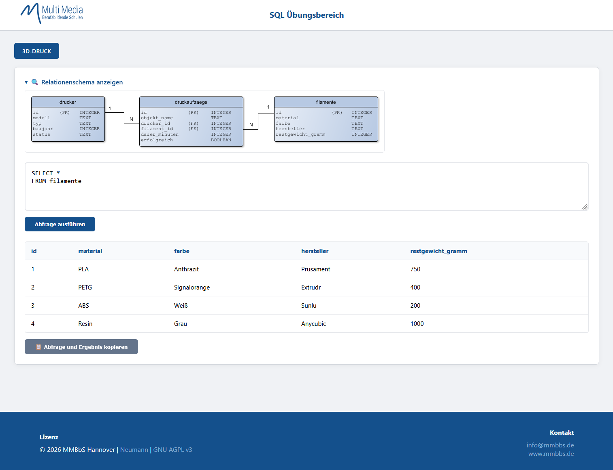

# SQL Übungsbereich

Ein leichtgewichtiges, webbasiertes Tool zum Erlernen und Üben von SQL-Abfragen auf Basis von SQLite. Entwickelt für den Einsatz im Unterricht an der **MultiMedia Berufsbildende Schule (MMBbS)**.

## 🚀 Features

*   **Automatisches DB-Setup:** Legt beim ersten Aufruf automatisch eine SQLite-Datenbank (`.db`) aus einer gleichnamigen `.sql`-Datei an.
*   **Multi-Datenbank-Support:** Erkennt alle `.sql`-Dateien im Verzeichnis und bietet diese als Tabs zur Auswahl an.
*   **Sicherheits-Filter:** Verhindert destruktive Befehle (DROP, DELETE, UPDATE, etc.), um die Integrität der Übungsdaten zu wahren (Read-Only Fokus).
*   **Schema-Visualisierung:** Bindet automatisch Relationenschemata ein, sofern eine Bilddatei (z.B. `name.png`) vorhanden ist.
*   **Copy-to-Clipboard:** Exportiert die SQL-Abfrage und das Ergebnis formatiert als ASCII-Tabelle für Dokumentationen oder Hausaufgaben.
*   

## 🖥️ Screenshot

## 🛠 Installation & Nutzung

1.  Kopiere die `index.php` auf einen Webserver mit PHP-Unterstützung und aktiviertem `sqlite3`-Modul.
2.  Lege deine SQL-Struktur- und Datendateien (z.B. `3d_druck.sql`) in denselben Ordner.
3.  (Optional) Füge ein Vorschaubild des Schemas hinzu (z.B. `3d_druck.png`).
4.  Rufe die Seite im Browser auf.

## 🔒 Sicherheitshinweise

Das Tool ist für **didaktische Zwecke in lokalen Umgebungen** konzipiert. Der integrierte Filter blockiert einfache Manipulationsversuche. Da SQLite jedoch direkt über das Dateisystem läuft, sollte die Anwendung nicht ungeschützt im offenen Internet ohne zusätzliche Absicherung (z.B. .htaccess) betrieben werden.

## 📜 Lizenz

Dieses Projekt ist unter der **GNU AGPL v3** lizenziert. Siehe Footer der Anwendung für Details.

© 2026 MMBbS Hannover | André Neumann